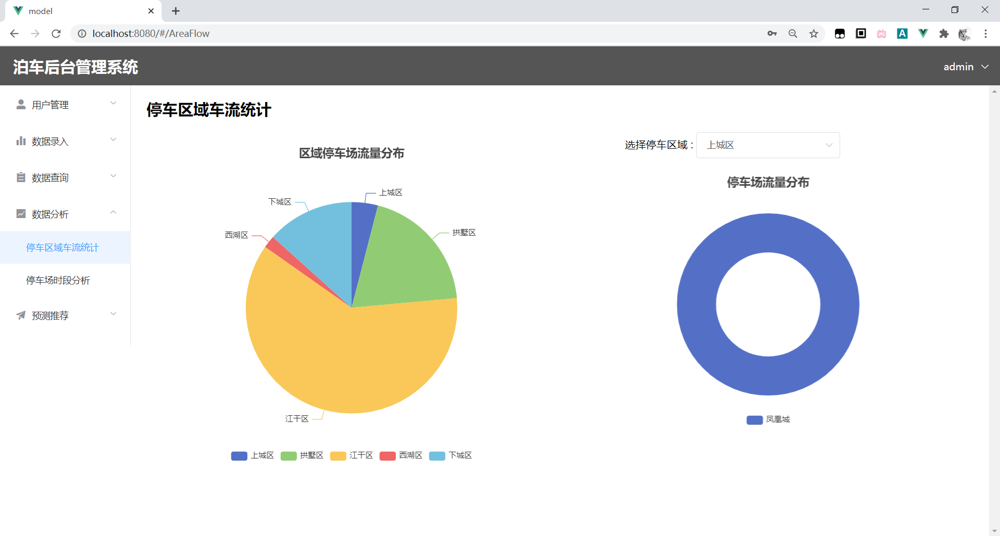

# model

## Project setup
```
npm install
```

### Compiles and hot-reloads for development
```
npm run serve
```

### Compiles and minifies for production
```
npm run build
```

### Customize configuration
See [Configuration Reference](https://cli.vuejs.org/config/).


### UiView

登录界面


用户管理界面


停车记录录入


停车场录入


数据查询


数据分析




车位预测

# grand-manager-web-server-master
