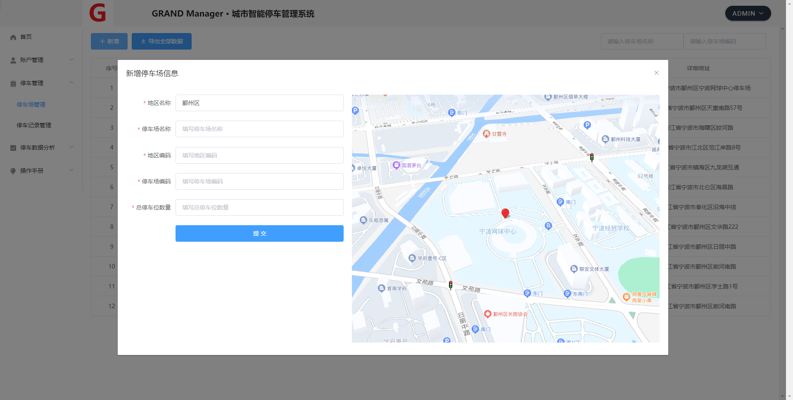
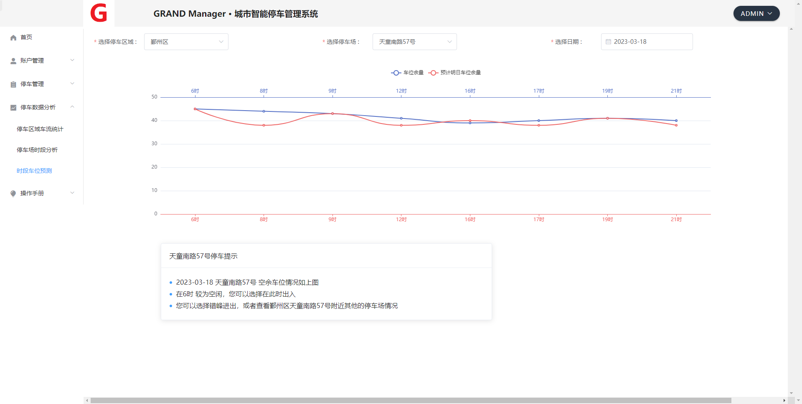

# model

## Project setup

```
npm install
```

### Compiles and hot-reloads for development

```
npm run serve
```

### Compiles and minifies for production

```
npm run build
```

### Customize configuration

See [Configuration Reference](https://cli.vuejs.org/config/).

### UiView

登录界面


注册界面


账户管理界面


停车场管理



停车记录管理


时段分析预测



# grand-manager-web-server-master
